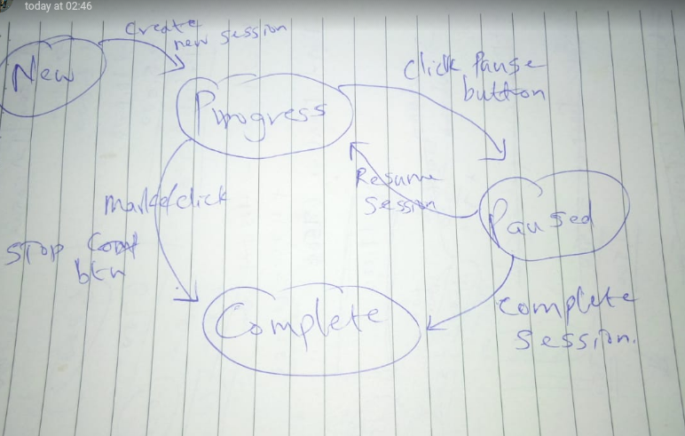

### Application Login
***
#### New skill
User adds a new skill on skills/add, and it appears on skills/list

#### Add progress for that skill
User clicks on the name/subject of the skill and app navigates to skills/:id/:name. From here the user should be able to add progress about what they have been doin.

## Session progress login

When app loads, **New** session is started. if there's already a existing session, it picks from there. When the **START** button is clicked, it changes text to **STOP** , and activates, **PAUSE** button.

1. **START** button pressed.
    - Activate **PAUSE** button
    - Change it's text to **STOP**
    - Dispatch start session
    - Dispatch new session is none
    - Set session state to *in-progress*
2. **PAUSE** button pressed
    - Change text to **RESUME**
    - Dispatch pause action
    - Set session state to *paused*
3. **RESUME** button pressed
    - Change text to **PAUSE**
    - Dispatch resume action
    - Set session state to *in-progress*
4. **STOP** button clicked
    - Set session state to *completes*
    - Dispatch complete-session action
    - Disable  **PAUSE** button
    - Show a dialog to collect session message

### Session states and buttons
A session will maintain it's state and can only be in one state. The possible states to have include *in-progress*, *paused*, *completed* and *new*.

##### *in-progress*
   - [ ] Pause button active
   - [ ] Stop button active

#### *paused*
   - [ ] Resume active
   - [ ] Stop active

#### *completed*
   - [ ] Pause diabled
   - [ ] Stop button disabled till state is new

### Sessions schema
It will store the following fields:
   - Skill ID - reference the skill
   - startTime - record time of start
   - End time - final time when they stopped
   - Pause time - to get time outside
   - Total time - session total in minutes
   - State - current state, new, in-progress, paused or completed
   - Notes - describe what you have done

### On navigating to skill
   - Load sessions for that skill
   - If no session is preset, create a new session
   - If there's a session in progress, notify the user to end one of them ( or we can have them both run but when one closes the other wont be recorded) and pick from the session in progress
   - Calculate the following pieces of information
        - total sessions
        - total time in minutes
        - load list of recent activities descending order
        - percentage of hours done for the progress bar
        - list of milestones achived
        - list milestones goals

#### Improvements/ Optimizations to be added later
 - Show the time of update in days or hours i.e yesterday, today, this week, last week
 - Close edit modal after edit
 - Add login and user authentication

